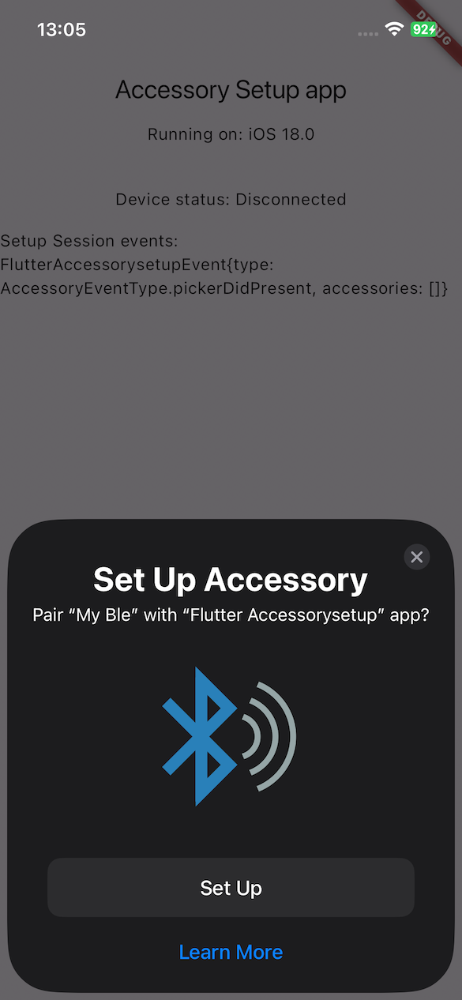

# Flutter Accessory Kit



At this stage the library supports:

- [x] BLE
- [x] WiFi
- [x] Migration

‼️ One important remark: by Apple's design, the library works only with **iOS 18 or above**. ‼️

## 🚇 How to use

Install the library using the command line:

```sh
flutter pub get flutter_accessorysetup
```

### ⚙️ Setup

- For the full details refer [apple docs](https://developer.apple.com/documentation/accessorysetupkit/discovering-and-configuring-accessories)
- You should add the keys to the [Info.plist](./example/ios/Runner/Info.plist) of the iOS app to make it work.
  ⚠️ **If you miss the required key the app will crash when you show the picker.** ⚠️

  - ALWAYS: (Bluetooth or WiFi, or both)

  ```xml
  <key>NSAccessorySetupKitSupports</key>
  <array>
    <string>Bluetooth</string>
    <string>WiFi</string>
  </array>
  ```

  - When you use the `ASDiscoveryDescriptor` with `bluetoothServiceUUID`  
    ⚠️ **The UUID string must be upper-cased here.** ⚠️

  ```xml
  <key>NSAccessorySetupBluetoothServices</key>
  <array>
    <string>149E9E42-33AD-41AD-8665-70D153533EC1</string>
  </array>
  ```

  - When you use the `ASDiscoveryDescriptor` with `bluetoothNameSubstring`  
    ⚠️ **Does not work in the iOS 18 Developer beta 2.** ⚠️

  ```xml
  <key>NSAccessorySetupBluetoothNames</key>
  <array>
    <string>DeviceName</string>
  </array>
  ```

  - There is an option with manufacturer ID that is not covered here.

- Use the `FlutterAccessorySetup` class. See the full code example in the [Example app](./example/lib/main.dart)

```dart
final _accessorySetup = FlutterAccessorySetup();

void activate() {
  _accessorySetup.eventStream.listen((event) {
        debugPrint('Got event: ${event.eventType}');
        // handle session events here
  }));
  await _accessorySetup.activate();
  try {
    _accessorySetup.showPickerForDevice(
      'My Ble', Assets.images.ble.path, '4013ABDE-11C0-49E7-9939-4B4567C26ADA'
    );
  } on PlatformException {
    debugPrint('Failed to show the picker');
  }
}

void deactivate() {
  accessorySetup.dispose();
  super.deactivate();
}
```

---

## ℹ️ What we know

- You app does not need Bluetooth permissions when you use the picker to work with bluetooth devices.

- It is very easy for user to select the device from a picker.

- ⚠️ If you want to have multiple devices of the same type displayed in the picker, each device should advertise a unique name. The picker will show only one device per unique name. If your device exposes 0x1800 service, the device name in that service should be unique too⚠️

- When the user closes the Picker by tapping the cross button, the `showPicker` closure emits an error (ASErrorDomain, code 700). Be prepared.

- ⚠️ When the person picks a BLE accessory, the picker sends an event of type `ASAccessoryEventType.accessoryChanged`. The picker is supposed to sends an event of type `ASAccessoryEventType.accessoryAdded`, but I can't reproduce it at all.⚠️

- If the device has been connected previously, it will be in the `session.accessories` array right after the session is activated.  
  ⚠️ **This device will not be discoverable by the Setup Picker until the user disconnects it from the settings.** ⚠️

- If the device has been connected by another app already, the picker will show the device as it was decorated by another app -> meaning the image and name will be from that app, not that you provide. To change the decoration the user should add the device to your app.

- When the user selects the device using the picker:
  - The device will be displayed in the `Accessories` of the mobile App settings at `Settings/Apps/YourApp`.
  - The device will be displayed in the `My Devices` section at `Settings/Bluetooth`.
  - The device's info screen will display the image and name you provided to the `ASPickerDisplayItem` during the discovery process (the same that the user saw in the picker).

- When the user deletes the app, the device will be disconnected automatically. It won't be displayed in the `My Devices` section of the `Settings/Bluetooth` screen anymore.

⚠️ The AccessorySetup does not work on the Simulator. ⚠️

---

## 📗 References

- <https://developer.apple.com/documentation/accessorysetupkit/discovering-and-configuring-accessories>
- <https://developer.apple.com/documentation/accessorysetupkit/authorizing-a-bluetooth-accessory-to-share-a-dice-roll>
